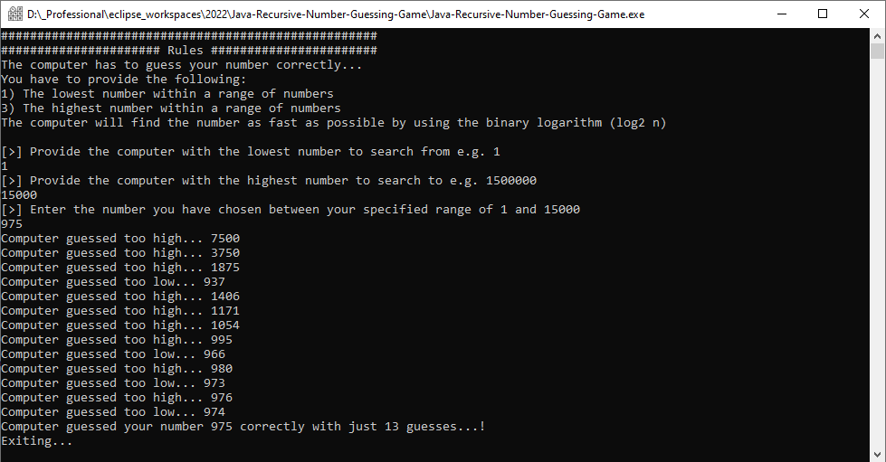

</a>

# Java-Recursive-Number-Guessing-Game

# Table of Contents

- [Java-Recursive-Number-Guessing-Game](#java-recursive-number-guessing-game)
- [Table of Contents](#table-of-contents)
- [Screenshot of the Application](#screenshot-of-the-application)
- [Description](#description)
- [Instructions](#instructions)
- [Package(s) used within the Application](#packages-used-within-the-application)
- [System requirements](#system-requirements)
- [Source Code](#source-code)

---

# Screenshot of the Application

 

# Description

This application is a **recursive** number guessing game which uses **binary search** method (divides the search criteria by half each time) that can call itself to guess the correct number. The logic uses a search Trie data structure to solve a number guessing game in the most efficient way possible with the binary logarithm (log2 n).

- Reduces the search in half each time (log2(n)).
- e.g. search `=log2(100000000)` on google to find out how many guesses it takes to find a number in a list of 1 billion numbers. (29 guesses)

> Very powerful search algorithm that can be used in many different ways.

# Instructions

- Clone the repo and run the executable file `Java-Recursive-Number-Guessing-Game.exe`

# Package(s) used within the Application

- java.util.Scanner;

# System requirements

- JavaSE-1.8 or higher.

# Source Code

The project was developed in Eclipse IDE and all source code and projects are uploaded as an Eclipse project for convenience.

- Source code is available to view in the src folder
- Compiled code located in the bin directory.
- Jar File
- Executable (.exe) File
